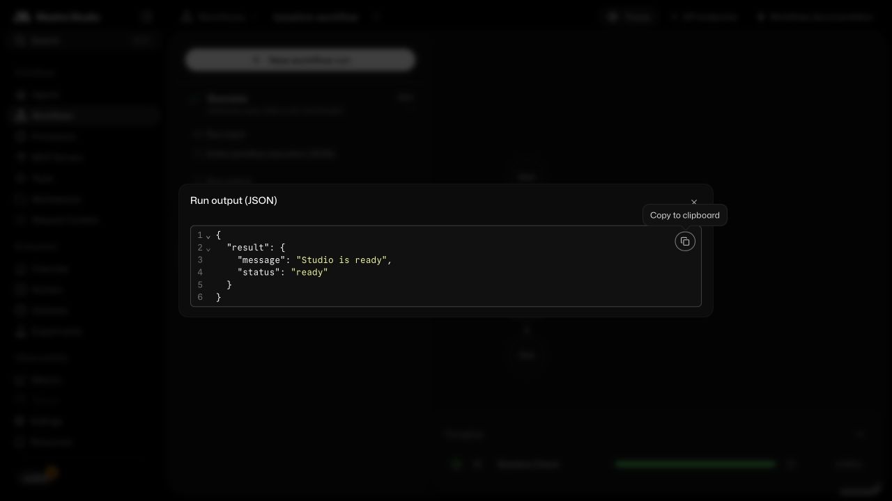

# Security Incident Triage and Response

Security Incident Triage and Response accepts synthetic identity-security alerts, gathers and correlates evidence against versioned runbooks, and produces a reviewable incident, summary, and containment plan. A human approval remains required before mock containment can run. It is built with Mastra.

## Why we built this

Security teams often have enough individual signals to investigate an incident, but collecting them, applying a runbook, and keeping a decision trail consistent is slow. This template gives engineers and security teams a local, inspectable path from an alert to an approval-gated response.

The default experience is deliberately mock-first. It makes the workflow and its limits practical to explore without connecting a production identity provider or sending data to an external service.

## Features

- Receives signed synthetic alerts for privilege changes, country changes, and unfamiliar devices through one investigation flow.
- Correlates identity, endpoint, and cloud evidence with an active runbook before proposing a response.
- Holds containment behind a tenant-scoped human approval and records the resulting timeline and audit trail.
- Runs locally with mock providers while keeping real-provider checks opt-in for staging.

## Quick start

### 1. Clone the template

```bash
npx create-mastra@latest template-security-incident-triage --template https://github.com/drantunes/template-security-incident-triage
cd template-security-incident-triage
```

### 2. Add your API keys

```bash
cp .env.example .env
```

The copied defaults start the local mock walkthrough without external API keys
or webhook secrets. Real WorkOS, IPinfo, Linear, and Upstash integrations are
staging opt-ins and fail early when their required configuration is incomplete.

### 3. Start the dev server

```bash
npm run dev
```

Open [Mastra Studio](http://localhost:4111), select `baselineWorkflow`, and
run it with `{ "message": "Studio is ready" }`. The result is
`{ "message": "Studio is ready", "status": "ready" }`.

## Mock workflow and limits

The mock flow can receive a signed alert, gather synthetic evidence, create a
plan, and wait for an approved mock decision. GeoIP is a probabilistic signal:
VPNs, proxies, and corporate networks can make a location look unusual. Device
identity is an opaque signed cookie rather than fingerprinting; removing or
rotating it can look like a new device. Treat either signal as evidence to
correlate, not proof on its own.

Retention scheduling is disabled in the default mock. For a long-lived local
environment, enable it only with one exact tenant identity and an explicit
bounded batch size; it runs at startup and every 24 hours. Inspect one tenant
first with `npm run retention:sweep -- --tenant <tenant> --limit <1-1024>`;
that command is dry-run by default and requires `--apply` to write.

### Studio result



Synthetic local Studio output from `baselineWorkflow`; it contains no external
account data.

## Making it yours

- Replace the mock identity, GeoIP, incident, and PubSub adapters with their
  existing staging contracts after configuring the corresponding provider.
- Adapt the versioned runbook policy and approval rules for your incident types,
  then add evaluation cases for the claims and actions you permit.

## About Mastra templates

Mastra templates are ready-to-use projects that show what you can build with
Mastra. Clone one, try it in Studio, and adapt it to your use case.

This community template is authored and maintained by Diego. Contributions
happen in this repository; read [CONTRIBUTING.md](CONTRIBUTING.md) and the
included [Apache-2.0 license](LICENSE).
